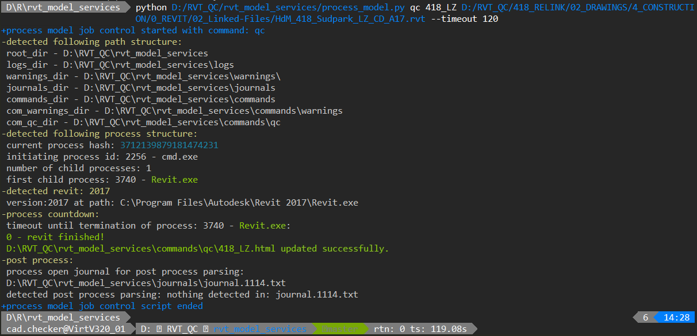

# rvt_model_services
Python micro framework to process actions on revit models from cli/command line

## how it works:
  * You initialize it with a command to process_model.py specifying the task, revit model and an optional timeout.
  * `process_model.py` will spin off a subprocess to write a journal file and add-in according to your specified task and project.
  * It will then run Revit according to this journal file, opening a detached version of your model and run the specified action, 
  like a [revitpythonshell](https://github.com/architecture-building-systems/revitpythonshell) script.
  * If the journal file cannot be run to completion, the subprocess is killed and an error is logged.<br>
  The logging journal file will be parsed and a notify email will inform you in case the model is corrupt.

## it requires/is currently run on:
  * CPython (64bit recommended) >= 3.7 (with additional modules)<br/>
    to install modules on your machine run<br>
    `pip install --user beautifulsoup4 bokeh colorama colorful docopt numpy pandas psutil olefile slackclient rvt_detector rjm`
  * Autodesk Revit® (currently tested on versions 2015.7, 2016.2, 2017.2, 2018, 2019.2, 2020.2)
  * see [install_guide](install_guide.md) for help/further information.

## how to get started:
  * When the above mentioned requirements are met and this repo is cloned to your preferred path, 
  let's get started with a common task (read qc stats (qc meaning "quality check" in this context)) in a few steps:

  * step 1: Run a qc read out from cli<br>
    Run `process_model.py` from command line:
    Now we can run the qc_model without even touching Revit and get interactive html graphs produced.
    Compose a command line instruction consisting of the following:

    `your CPython interpreter`<br>
    `your path to process_model.py`<br>
    `command name`<br>
    `project name`<br>
    `full path to the project Revit model`<br>
    `a timeout for the process (optional - default is 60 seconds)`<br>

    So it could look like this:
    
    ```
    "C:\Program Files\Python37\python.exe"
    D:/testrun/934_rvt_model_services/process_model.py
    qc
    123_N
    D:/testmodel/123_N.rvt
    --timeout 600
    ```

    Just concatenate it (put it into one line with spaces separated):<br>
    `"C:\Program Files\Python37\python.exe" D:/testrun/934_rvt_model_services/process_model.py qc 123_N D:/testmodel/123_N.rvt --timeout 600`<br>
    Open a command line ("Win > type 'cmd'") paste it in("right-click > paste") and run it.<br>
    If you want to write the html to another directory you can use the optional switch "--html_path" followed by a path.<br>
    Here is how this looks on my screen:

    

  * step 2: Let task scheduler repeat your task<br>
    For recurring tasks hook it up to Windows® task scheduler:
    Open Task scheduler and create a new basic task<br>
        - give it a name<br>
        - set your interval rate e.g. daily<br>
        - set your start time<br>
        - action: start program:<br>
            Program/Script:<br>
                `"C:\Program Files\Python37\python.exe"`<br>
            Add Arguments:<br>
                `D:/testrun/934_rvt_model_services/process_model.py qc 123_N D:/testmodel/123_N.rvt --timeout 600`<br>
        - Finish and test if it works: "Right-Click > Run"

## further options:    
  * If you are too lazy to type the path for different projects all the time (like me) you can set them up in a config.ini like this:<br>

    ```
    [123_N]
    path = D:/testmodel/123_N.rvt
    ```
    With this setup you can substitute the actual full_model_path in your command with just: `cfg`
    
  * If you want to get notified on model corruption or circular links just add the flag `--notify`
    to setup notifications (currently email or slack) refer to the README.md of the notify module.

## typical use cases(recurring tasks run via schedule Task Scheduler):
  * Extraction of qc data to be gathered in csv table and visualized on interactive html graphs using bokeh
  * Check on model corruption with audit canary
  * Export of DWF, DWG, PDF or IFC (so far only DWF export implemented)
  * Export model warnings (API-less journal file warnings export)
  * Migrating large heavily inter-linked Revit projects to different directories and/or Revit versions.

## currently implemented commands:
  * [qc](commands/qc):<br>
    rvt model qc statistics on workshared models<br>

    

  * [qc_no_ws](commands/qc_no_ws):<br>
    Same as the above command without opening model worksets

  * [dwf](commands/dwf):<br>
    DWF sheet exports of sheet set "Auto_PDF_DWF" on workshared models<br>

  * [dwg](commands/dwg):<br>
    DWG sheet exports of sheet set "Auto_PDF_DWG" on workshared models<br>

  * [warnings](commands/warnings):<br>
    Model warnings export on workshared models, pre-rvt2018<br>

    

  * [pulse](commands/pulse):<br>
    Bokeh graph showing the job log graphically(which project was process in what time, did it timeout -> red bar).<br>
    run separately from process_model with: "python bokeh_pulse.py" from commands/pulse/ directory.

    

  * [audit](commands/audit):<br>
    Bokeh graph showing the rusult of models being opened with "audit".<br>
    if configured an email will be sent if the model is corrupt. see readme for email config guide in notify/email/<br>
    success: green, unclassified error:orange, corrupt model: red.<br>
    run separately from process_model with: "python bokeh_pulse.py" from commands/pulse/ directory.

    

  * [audit_no_ws](commands/audit_no_ws):<br>
    Same as the above command without opening model worksets
    
  * [relink](commands/relink): 
    Re-links rvt and cad links of models in transmitted model state

  * [upgrade](commands/upgrade): 
    Upgrades rvt models

  * [move](commands/move): 
    Moves rvt models to target directories

## how to extend:
  * rvt_model_services was created with extensibility in mind. 
  If you wish to extend the functionality, just copy cookiecutter 
  command and adjust or override. As non-built-in commands are .gitignored, 
  your custom commands should not break your vcs.

## known limitations:
  - of journal files:
    * no white spaces in model path
    * no non-ascii characters in model path
    * task will not run to completion if confronted with any unexpected messages<br>
  - of this framework:
    * do not schedule overlapping readouts, the simple pandas code is not (yet) prepared to handle this in the graphs
    * if you want to use windows network paths use the `--nofilecheck` option

## credits
 * Frederic Beaupere (original version, maintainer)
 * Ehsan Iran-Nejad (creator of rvt_model_services embedded C# [excecutor](executor), creator of [pyRevit](https://github.com/eirannejad/pyRevit))
 * Daren Thomas (creator of [revitpythonshell](https://github.com/architecture-building-systems/revitpythonshell))
 * Gui Talarico (creator of [revitpythonwrapper](https://github.com/gtalarico/revitpythonwrapper) and [revitapidocs](https://github.com/gtalarico/revitapidocs))

note: If you are not on this list, but believe you should be, please contact me!

## license
[MIT](https://opensource.org/licenses/MIT)
